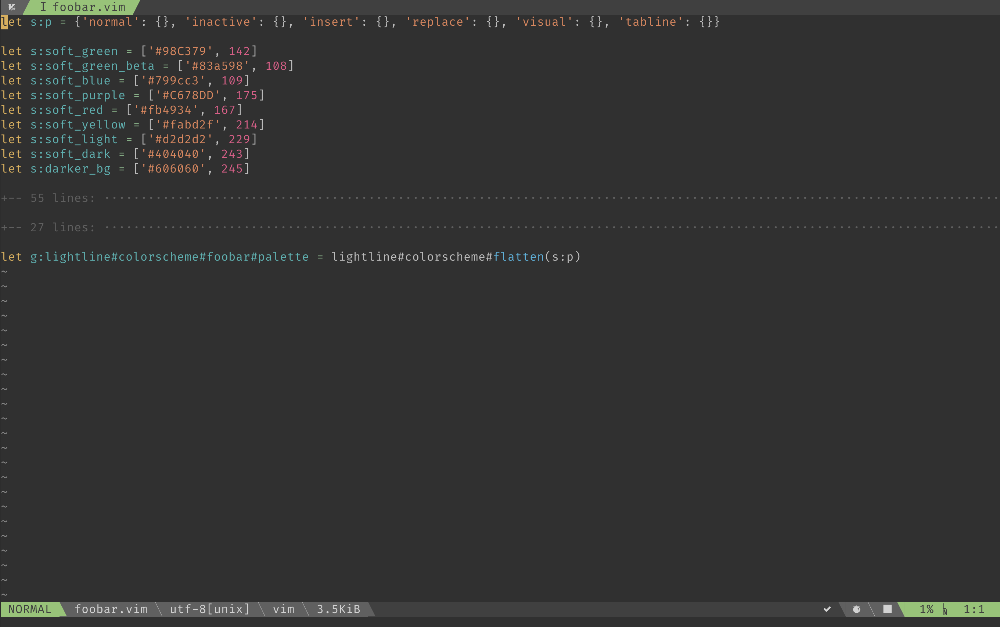
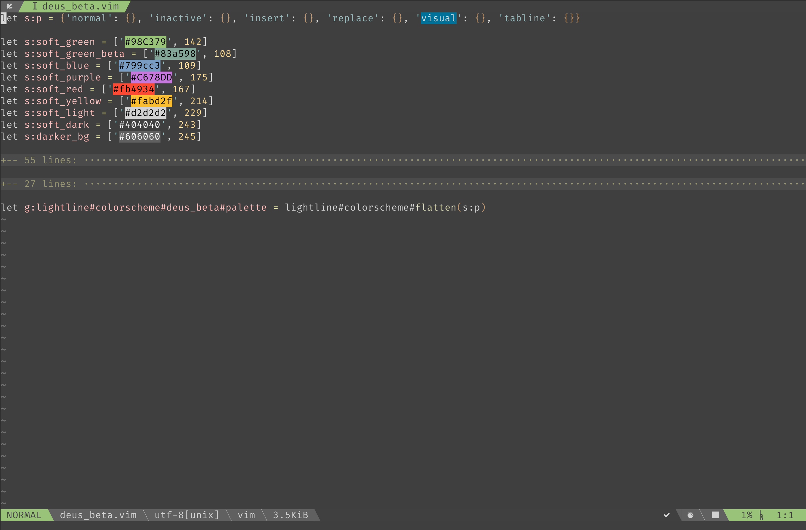

# Demo



*combined with [neodark](https://github.com/KeitaNakamura/neodark.vim)*



*combined with [seoul256](https://github.com/junegunn/seoul256.vim)*

# Installation

for [vim-plug](https://github.com/junegunn/vim-plug):

```
Plug 'sainnhe/lightline_foobar.vim'
```

# Usage

put this in your vimrc:

```
let g:lightline.colorscheme = 'foobar'
```

or if you want to apply it without reload:

```
:let g:lightline.colorscheme = 'foobar'
:call lightline#init()
:call lightline#colorscheme()
:call lightline#update()
```
