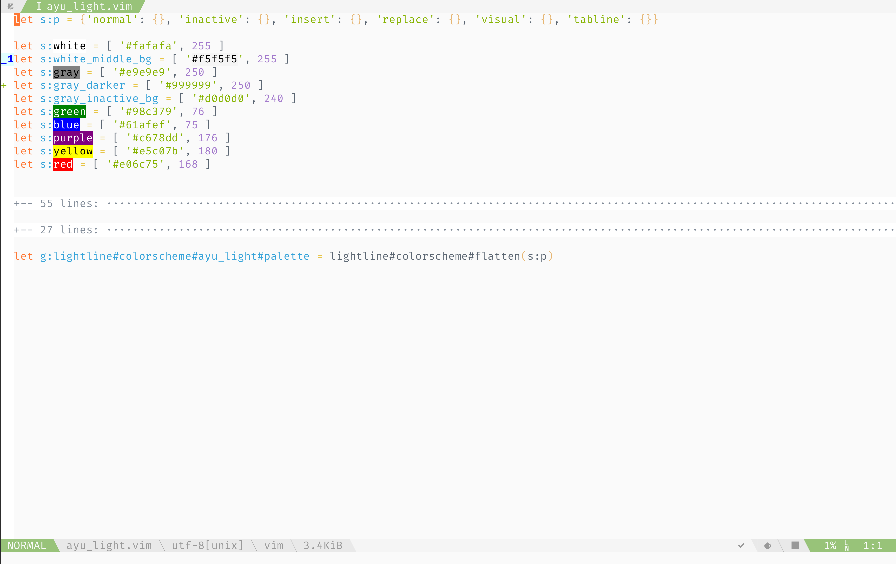

# Demo



`let g:lightline.colorscheme = 'ayu_light'` && [ayu](https://github.com/ayu-theme/ayu-vim)


`let g:lightline.colorscheme = 'softera_alter'` && [soft-era](https://github.com/sainnhe/soft-era-vim) modified version


`let g:lightline.colorscheme = 'srcery_alter'` && [vorange](https://github.com/Marfisc/vorange)


`let g:lightline.colorscheme = 'colored_dark'` && [cosme](https://github.com/beikome/cosme.vim)


`let g:lightline.colorscheme = 'carbonized_alter'` && [carbonized](https://github.com/nightsense/carbonized)


`let g:lightline.colorscheme = 'deus_beta_light'` && [seoul256](https://github.com/junegunn/seoul256.vim)


`let g:lightline.colorscheme = 'deus_beta_dark'` && [neodark](https://github.com/KeitaNakamura/neodark.vim)


`let g:lightline.colorscheme = 'neodark_alter'` && [neodark](https://github.com/KeitaNakamura/neodark.vim)


`let g:lightline.colorscheme = 'tfw_light'` && [two-firewatch light](https://github.com/rakr/vim-two-firewatch)


`let g:lightline.colorscheme = 'tfw_dark'` && [two-firewatch dark](https://github.com/rakr/vim-two-firewatch)


[Merged](https://github.com/logico-dev/typewriter/commit/81dd8738cfff6d9ce01e6c42d14b0761acbba064) ~~`let g:lightline.colorscheme = 'typewriter_light'` && [typewriter](https://github.com/sainnhe/typewriter) modified version~~


[Merged](https://github.com/logico-dev/typewriter/commit/81dd8738cfff6d9ce01e6c42d14b0761acbba064) ~~`let g:lightline.colorscheme = 'typewriter_dark'` && [typewriter](https://github.com/sainnhe/typewriter) modified version~~


`let g:lightline.colorscheme = 'pencil_alter'` && [pencil](https://github.com/reedes/vim-colors-pencil)


`let g:lightline.colorscheme = 'sacredforest'` && [sacredforest](https://github.com/KKPMW/sacredforest-vim)

# Installation

for [vim-plug](https://github.com/junegunn/vim-plug):

```
Plug 'sainnhe/lightline_foobar.vim'
```

# Usage

put this in your vimrc:

```
let g:lightline.colorscheme = 'foobar'
```

or if you want to apply it without reload:

```
:let g:lightline.colorscheme = 'foobar'
:call lightline#init()
:call lightline#colorscheme()
:call lightline#update()
```

where `foobar` is the name of a color scheme.

check [Demo](https://github.com/sainnhe/lightline_foobar.vim#demo) for all available color schemes.
